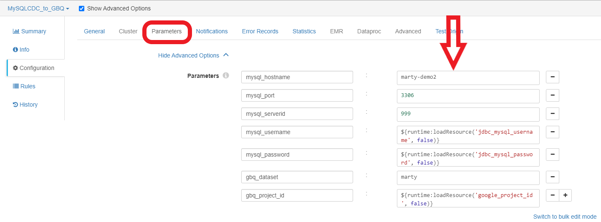
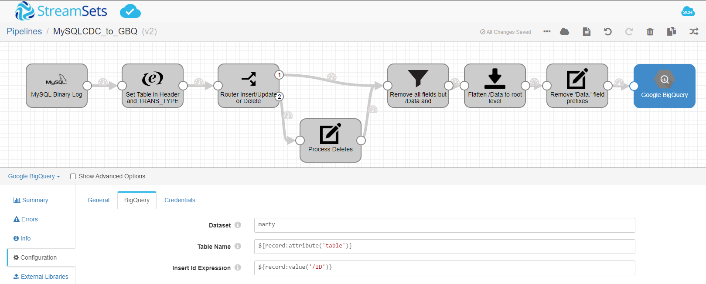
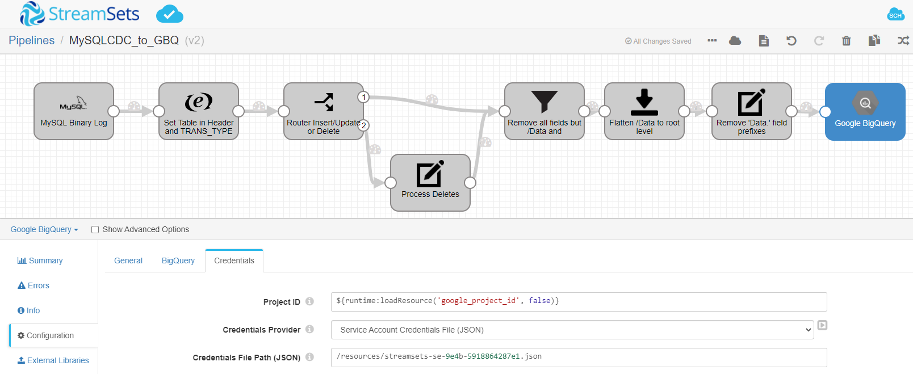
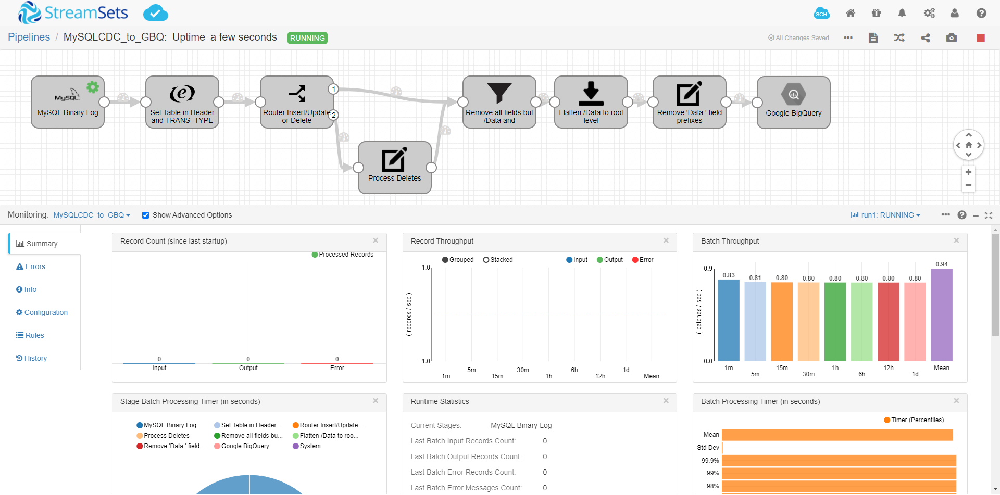
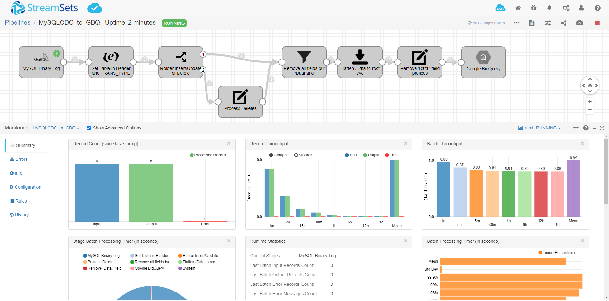

<h1>
MySQL CDC to Google BigQuery
</h1>

# MySQL CDC to Google BigQuerySnowflake

**Important:** *These instructions assume you have access to StreamSets Data Collector (v3.15+) and have performed all the prerequisites for MySQL*

- For help installing [StreamSets Data Collector](https://streamsets.com/products/dataops-platform/data-collector/), see [StreamSets Data Collector Installation](https://streamsets.com/documentation/datacollector/latest/help/datacollector/UserGuide/Installation/Install_title.html).
- For help with MySQL Binary Log prerequisites, see [MySQL Binary Log](https://streamsets.com/documentation/datacollector/latest/help/datacollector/UserGuide/Origins/MySQLBinaryLog.html).

Here is a link to videos on using StreamSets Data Collector: [Video Link](https://www.youtube.com/channel/UC_4K-__dngOCEmoZs7PVZAg)

## OVERVIEW

This pipeline demonstrates how to read change data capture (CDC) data from a MySQL database and load that data to Google BigQuery.

**Disclaimer:** *This pipeline is meant to serve as a template for performing MySQL binlog CDC to Google BigQuery.  Some of the parameters, tables and fields may be different for your environment and may need additional customizations.  Please consult the StreamSets documentation (linked below) for full information on configuration of each stage used below.*

## PIPELINE

## DOCUMENTATION

[MySQL Binlog Origin](https://streamsets.com/documentation/datacollector/latest/help/datacollector/UserGuide/Origins/MySQLBinaryLog.html)

[Expression Evaluator](https://streamsets.com/documentation/datacollector/latest/help/datacollector/UserGuide/Processors/Expression.html)

[StreamSelector](https://streamsets.com/documentation/datacollector/latest/help/datacollector/UserGuide/Processors/StreamSelector.html)

[Field Renamer](https://streamsets.com/documentation/datacollector/latest/help/datacollector/UserGuide/Processors/FieldRenamer.html)

[Field Remover](https://streamsets.com/documentation/datacollector/latest/help/datacollector/UserGuide/Processors/FieldRemover.html#concept_jdd_blr_wq)

[Field Flattener](https://streamsets.com/documentation/datacollector/latest/help/datacollector/UserGuide/Processors/FieldFlattener.html#concept_njn_3kk_fx)

[Google BigQuery](https://streamsets.com/documentation/datacollector/latest/help/datacollector/UserGuide/Destinations/BigQuery.html#concept_hj4_brk_dbb)

## STEP-BY-STEP

### Step 1: Download the pipeline

[Click Here](./MySQLCDC_to_GBQ.zip?raw=true) to download the pipeline and save it to your drive.

### Step 2: Import the pipeline

Click the down arrow next to the "Create New Pipeline" and select "Import Pipeline From Archive".

Click "Browse" and locate the pipeline file you just downloaded, click "OK", then click "Import"

### Step 3: Configure the parameters

Click on the pipeline you just imported to open it and click on the "Show Advanced Options" and then click the "Parameters" tab and fill in the appropriate information for your environment.

**Important:** *The pipeline template uses the most common default settings. All of these are configurable and if you need to change those, you can opt to not use the built-in parameters and choose the appropriate settings yourself. Please refer to the documentation listed in this document for all the available options.*

The following parameters are set up for this pipeline:

<table>
  <tr>
   <td><code>mysql_hostname</code>
   </td>
   <td class="entry cellrowborder" headers="d436212e756 ">MySQL server hostname.</td>
  </tr>
  <tr>
   <td><code>mysql_port</code>
   </td>
   <td class="entry cellrowborder" headers="d436212e756 ">MySQL server port. </td>
  </tr>
  <tr>
   <td><code>mysql_serverid</code>
   </td>
   <td class="entry cellrowborder" headers="d436212e756 ">Replication server ID that the origin uses to connect to
                                        the master MySQL server. Must be unique from the server ID
                                        of the replication master and of all the other replication
                                            slaves.
When the MySQL server database is enabled for
                                            GTID, the server ID is optional. 

</td>
  </tr>
  <tr>
   <td><code>mysql_username</code>
   </td>
   <td class="entry cellrowborder" headers="d436212e853 ">MySQL username. 
The user must have the following MySQL
                                                privileges:<ul>
                                                <li>REPLICATION CLIENT</li>
                                                <li>REPLICATION SLAVE</li>
                                            </ul>

</td>
  </tr>
  <tr>
   <td><code>mysql_password</code>
   </td>
   <td class="entry cellrowborder" headers="d436212e853 ">MySQL password.
Tip: To secure sensitive information such as user names and passwords, you can use <a class="xref" href="https://streamsets.com/documentation/datacollector/latest/help/index.html?contextID=concept_bs4_5nm_2s" title="Similar to runtime properties, runtime resources are values that you define in a file local to the Data Collector and call from within a pipeline. But with runtime resources, you can restrict the permissions for the files to secure information.">runtime resources</a> or <a class="xref" href="https://streamsets.com/documentation/datacollector/latest/help/index.html?contextID=concept_bt1_bpj_r1b">credential stores.</a>

</td>
  </tr>
</table>

### Step 3b: Configure Google BigQuery

Click on the Google BigQuery destination and configure the appropriate values

### Step 4: Run the pipeline

Click the "START" button to run the pipeline.

### Step 5: Make changes to the MySQL source table and see the pipeline process them

